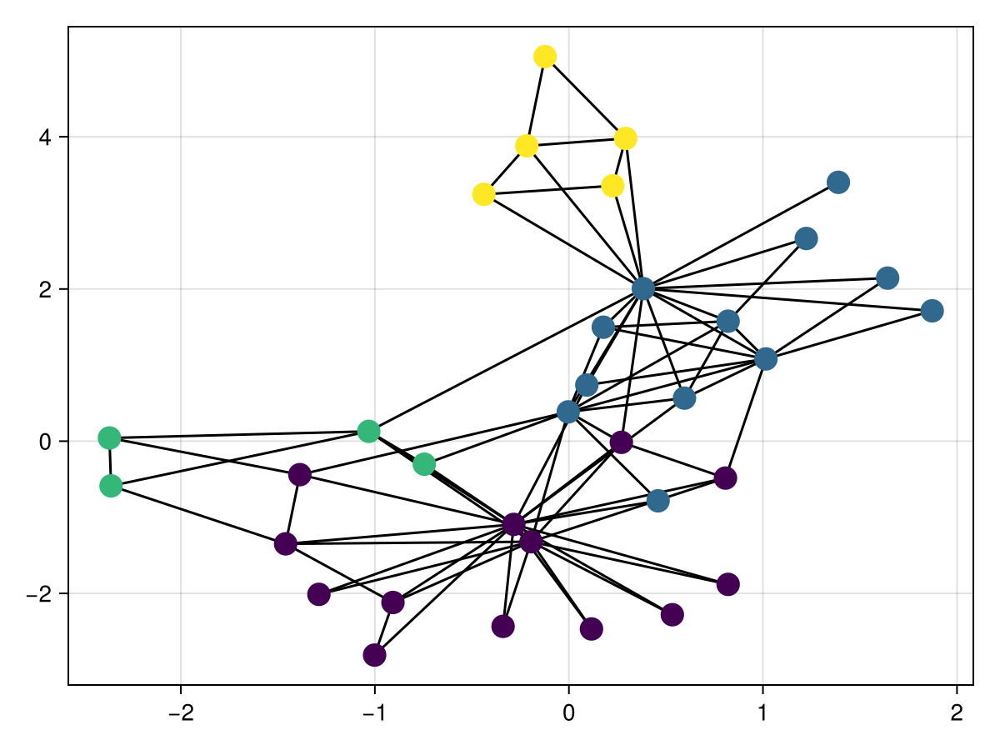
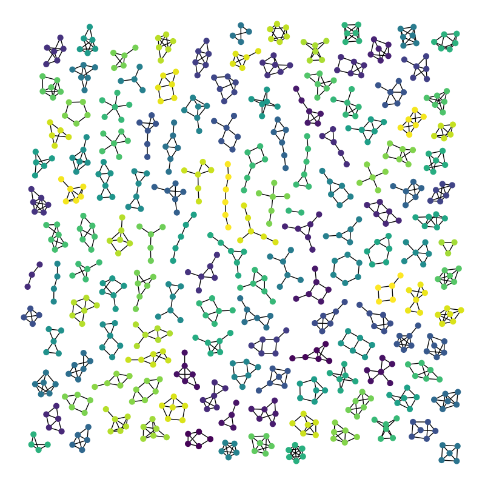

```@meta
EditURL = "/Users/carlo/.julia/dev/GraphNeuralNetworks/GraphNeuralNetworks/docs/tutorials/index.md"
```

# [Tutorials](@id tutorials)

---

# Beginner tutorials


```@raw html
<div class="grid-card-section">
```

```@raw html
<div class="card grid-card">
<div class="grid-card-cover">
<div class="grid-card-description">
```
Recently, deep learning on graphs has emerged to one of the hottest research fields in the deep learning community. Here, **Graph Neural Networks (GNNs)** aim to generalize classical deep learning concepts to irregular structured data (in contrast to images or texts) and to enable neural networks to reason about objects and their relations.
```@raw html
</div>
```
[](@ref Hands-on-introduction-to-Graph-Neural-Networks)
```@raw html
</div>
<div class="grid-card-text">
```

[Hands-on introduction to Graph Neural Networks](@ref Hands-on-introduction-to-Graph-Neural-Networks)

```@raw html
</div>
</div>
```

```@raw html
<div class="card grid-card">
<div class="grid-card-cover">
<div class="grid-card-description">
```
In this tutorial session we will have a closer look at how to apply **Graph Neural Networks (GNNs) to the task of graph classification**. Graph classification refers to the problem of classifying entire graphs (in contrast to nodes), given a **dataset of graphs**, based on some structural graph properties and possibly on some input node features. Here, we want to embed entire graphs, and we want to embed those graphs in such a way so that they are linearly separable given a task at hand. We will...
```@raw html
</div>
```
[](@ref Supervised-Graph-Classification)
```@raw html
</div>
<div class="grid-card-text">
```

[Supervised Graph Classification](@ref Supervised-Graph-Classification)

```@raw html
</div>
</div>
```

```@raw html
<div class="card grid-card">
<div class="grid-card-cover">
<div class="grid-card-description">
```
In this tutorial, we will be learning how to use Graph Neural Networks (GNNs) for node classification. Given the ground-truth labels of only a small subset of nodes, and want to infer the labels for all the remaining nodes (transductive learning).
```@raw html
</div>
```
[](@ref Semi-Supervised-Node-Classification)
```@raw html
</div>
<div class="grid-card-text">
```

[Semi-Supervised Node Classification](@ref Semi-Supervised-Node-Classification)

```@raw html
</div>
</div>
```


```@raw html
</div>
```

# Intermediate tutorials


```@raw html
<div class="grid-card-section">
```

```@raw html
<div class="card grid-card">
<div class="grid-card-cover">
<div class="grid-card-description">
```
In this tutorial, we will learn how to use a recurrent Temporal Graph Convolutional Network (TGCN) to predict traffic in a spatio-temporal setting. Traffic forecasting is the problem of predicting future traffic trends on a road network given historical traffic data, such as, in our case, traffic speed and time of day.
```@raw html
</div>
```
[](@ref Traffic-Prediction-using-Recurrent-Temporal-GNN)
```@raw html
</div>
<div class="grid-card-text">
```

[Traffic Prediction using Recurrent Temporal GNN](@ref Traffic-Prediction-using-Recurrent-Temporal-GNN)

```@raw html
</div>
</div>
```


```@raw html
</div>
```


---

## Contributions

If you have a suggestion on adding new tutorials, feel free to create a new issue
[here](https://github.com/JuliaGraphs/GraphNeuralNetworks.jl/issues/new).
Users are invited to contribute demonstrations of their own.
If you want to contribute new tutorials and looking for inspiration,
checkout these tutorials from
[PyTorch Geometric](https://pytorch-geometric.readthedocs.io/en/latest/notes/colabs.html).
